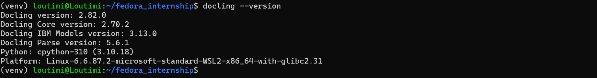

# Docling Document Processing Exploration

A hands-on exploration of [Docling](https://github.com/DS4SD/docling) — IBM's open-source document conversion library — carried out as part of my contributions to the [Fedora Project](https://fedoraproject.org/) through the [Outreachy](https://www.outreachy.org/) internship programme.

The goal was to install Docling, convert documents across multiple formats and pipelines, and evaluate the differences in output quality, processing time, and resource usage.

---

## Project Structure

```
fedora_internship/
├── command_screenshots/        # Terminal screenshot of each command run
│   ├── 1_install_docling.png
│   ├── 2_check_docling_version.png
│   ├── 3_docling_default_pdf.png
│   ├── 4_docling_pytorch_conf_ss.png
│   ├── 5_no_ocr_output.png
|   ├── 6_fedora_guidelines_ss_html.png
|   ├── 7_pytorch_pdf_toJSON_embedded_images.png
|   ├── 8_focus_on_tables_from_rainfall_pdf.png
|   └── 15_force_ocr_with_profiling.png
├── images_used/                # Image inputs used for conversion
│   └── fedora_guidelines.png
├── output_files/               # All conversion outputs
│   ├── asr_file/               # Audio transcription output
│   ├── docling_default_file/   # Default dockling markdown conversion
│   ├── fedora_ss_file/         # Image-to-HTML conversion
│   ├── pdf_scanned_ocr_file/   # Scanned PDF via VLM pipeline
│   ├── pytorch_conf_file/      # Multiple conversions of conference PDF
│   └── rainfall_file/
│       └── tables_only/        # Table-focused JSON HTML and markdown extraction
├── pdfs_used/                  # Source PDF documents
│   ├── image_text.pdf
│   ├── pdf_scanned_ocr.pdf
│   ├── pytorch_conference.pdf
│   └── rainfall.pdf
├── .gitignore
└── README.md
```

---

## Environment Setup

- OS: Ubuntu 20.04 (WSL2 on Windows 11)
- Python: 3.10.18
- Virtual environment: `venv`
- Docling installed via pip inside the virtual environment

```bash
python3.10 -m venv venv
source venv/bin/activate
pip install docling
pip install "docling[asr]"   # Required separately for audio transcription
sudo apt install ffmpeg      # Required for certain audio file formats
```

---

## Commands Run

### 1. Install Docling
```bash
pip install docling
```


### 2. Check Docling version
```bash
docling --version
```


### 3. Default PDF conversion (Markdown output)
```bash
docling https://arxiv.org/pdf/2206.01062
```
Fetches a remote arxiv research paper and converts it to Markdown using the default pipeline, including OCR model inference.


### 4. Convert with OCR disabled
```bash
docling pytorch_conference.pdf --no-ocr
```
Skips the OCR pipeline and reads directly from the PDF's native text layer.


### 5. Image to HTML
```bash
docling images_used/fedora_guidelines.png --from image --to html --output output_files/fedora_ss_file
```
Converts a PNG screenshot of the Fedora packaging guidelines to HTML.


### 6. PDF to JSON with embedded images
```bash
docling pdfs_used/pytorch_conference.pdf --image-export-mode embedded --to json --output output_files/pytorch_conf_file/to_json/
```
Exports to JSON with images embedded directly inside the output file as base64.


### 7. Table-focused JSON extraction
```bash
docling pdfs_used/rainfall.pdf --tables --to json --output output_files/rainfall_file/tables_only/
```
Focuses processing on table structures and outputs to JSON.


### 8. Markdown with referenced image export
```bash
docling pdfs_used/pytorch_conference.pdf --image-export-mode referenced --to md --output output_files/pytorch_conf_file/separate_image_export_mode/
```
Exports images as separate files in an artifacts folder, with the Markdown output linking to them.


### 9. Force OCR with profiling
```bash
docling pdfs_used/pytorch_conference.pdf --force-ocr --profiling --image-export-mode referenced --to md --output output_files/pytorch_conf_file/force_ocr_with_profiling/
```
Forces OCR even on a born-digital PDF and enables profiling to measure processing time per stage.


### 10. Audio transcription (ASR)
```bash
docling https://cdn.bookey.app/audio/orig/20240215153159356_1.mp3 --asr-model whisper_base --output output_files/asr_file
```
Transcribes an audio file using OpenAI's Whisper base model. Requires `pip install "docling[asr]"` and `ffmpeg`.


### 11. VLM pipeline on image-heavy PDF
```bash
docling pdfs_used/image_text.pdf --pipeline vlm --vlm-model smoldocling --num-threads 6 --image-export-mode referenced --output output_files/image_text_file/vlm_pipeline
```
Uses the Vision Language Model pipeline with SmolDocling for richer understanding of image-heavy documents.


### 12. VLM pipeline on scanned PDF
```bash
docling pdfs_used/pdf_scanned_ocr.pdf --pipeline vlm --vlm-model smoldocling --num-threads 6 --image-export-mode referenced --output output_files/pdf_scanned_ocr_file/vlm_pipeline
```
Applies VLM pipeline to a scanned (non-digital) PDF.


---

## Findings & Analysis

### OCR vs No-OCR
Running `--no-ocr` on a born-digital PDF (`pytorch_conference.pdf`) produced **identical output** to the default OCR pipeline — confirmed via `diff`. This demonstrates that for digitally created PDFs with an embedded text layer, OCR adds no value. The `--no-ocr` flag is significantly faster and lighter on compute, making it the smarter choice for this class of document. OCR becomes essential only for scanned or image-based PDFs where no text layer exists.

### Image Export Modes: `embedded` vs `referenced`
- `--image-export-mode embedded` encodes all images as base64 directly inside the output file. The result is a single self-contained file but considerably larger in size.
- `--image-export-mode referenced` extracts images into a separate `artifacts/` folder and replaces them with relative links in the output. This keeps the output file lean and makes images independently accessible, which is preferable for downstream processing pipelines.

### Output Format Comparison: Markdown vs HTML vs JSON
- **Markdown** is clean and readable, best for documentation and human review.
- **HTML** preserves more layout structure and is better for rendering in a browser, though the file size is larger.
- **JSON** is the strongest choice when the downstream goal is programmatic processing, especially for table-heavy documents. The `--tables` flag combined with JSON output produces well-structured table data that is directly usable in data pipelines.

### `--tables` Flag Behaviour
The `--tables` flag does not extract tables in isolation — it instructs Docling to give table structures higher processing priority, resulting in more accurate and complete table representation in the output. Combined with JSON output format, this is the most effective approach for data extraction from structured documents.

### VLM Pipeline Performance
The VLM pipeline (`--pipeline vlm --vlm-model smoldocling`) is significantly more resource-intensive than the default pipeline. On a CPU-only environment (no NVIDIA GPU), conversion of a multi-page image-heavy PDF ran for over 3 hours before being cancelled. Even a reduced-page version (`pdf_scanned_ocr.pdf`) exceeded one hour of processing time. This pipeline is best suited to GPU-equipped environments and is not practical for CPU-only machines on large documents.

### ASR (Audio Transcription)
Docling's ASR capability does not ship with the default installation — it requires `pip install "docling[asr]"` as a separate step. Additionally, certain audio formats require `ffmpeg` to be installed at the system level (`sudo apt install ffmpeg`). Once set up, the Whisper base model handled transcription cleanly.

### CPU Hardware Random Number Generator Warning
When running Docling with OCR enabled, the following warnings may appear:

```
WARNING: CPU random generator seem to be failing, disabling hardware random number generation
WARNING: RDRND generated: 0xffffffff 0xffffffff 0xffffffff 0xffffffff
```

This warning indicates that the system attempted to use the CPU’s hardware-based random number generator (RDRAND), but it did not return valid values. As a result, the underlying libraries (used by OCR and model inference) automatically disable hardware randomness and fall back to a software-based random number generator. It does not interrupt or fail the document processing pipeline and it's common in in virtualized environments such as WSL.

### Transformer Tokenization Warning

```
UserWarning: `max_length` is ignored when `padding`=`True` and there is no truncation strategy.
```

This warning originates from the Transformers library used by Docling’s VLM pipeline. It indicates that a max_length parameter was set internally, but since padding is enabled without truncation, the maximum length constraint is not applied during tokenization. It does not affect the correctness of the output. It only indicates how input sequences are padded internally

---

## Key Takeaways

- Match the pipeline to the document type: `--no-ocr` for born-digital PDFs, default OCR for scanned text, VLM for image-heavy or complex layouts (with GPU)
- Use JSON output for data extraction pipelines, Markdown for documentation, HTML for browser rendering
- `--image-export-mode referenced` is preferable for multi-image documents going into downstream processing
- VLM pipelines demand significant hardware — CPU-only environments are not practical for large documents
- ASR and ffmpeg must be installed separately and intentionally

---

## Related

- Blog post: [illuminous.hashnode.dev](https://illuminous.hashnode.dev)
- Docling documentation: [docling-project.github.io/docling/](https://docling-project.github.io/docling/)

