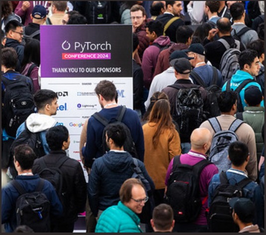
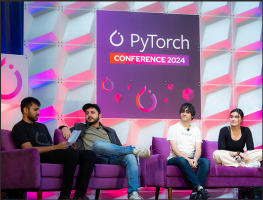
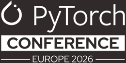
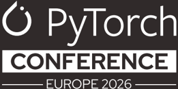
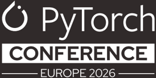

## PyTorch CONFERENCE

—EUROPE2026

7-8 April 2026 I Paris, France

## 2026 SPONS0RSHIP PROSPECTUS

## About PyTorch Conference

7-8 April 2026 | Paris, France

Don't miss your opportunity to shape the future of generative Al/ML! Join us at the PyTorch Conference machine learning framework. This conference brings together leading researchers, developers, and academics, facilitating collaboration and pushing forward end-to-end machine learning.

"Thiswashands-downoneof thebestorganized andmostenjoyableconferencesI'vebeentoin the last many years."

"There is a reason why I brought so much of my engineering team here, there is absolutely noreplacementforthein-personconnection and collaboration that you get from the folks whoyou'reworkingwithregularly in GitHub,on the Pytorch Forums, and even inside your own company."

"You never know where the next conversation will take you and what opportunities it will unlock in your career."

"It has been unanimously saluted as a memorable experience, featuring insightful discussions, innovative ideas, and a collaborative atmosphere that showcased the best of our community."

"Thank you again for creating this standardsetting conference, I am already looking forward to next year's event and the opportunity to continue pushing the boundaries of what's possible with the PyTorch ecosystem."

## 2026 SPONSORSHIP PROSPECTUS

## Why Sponsor

Sponsoring the PyTorch Conference Europe is a strategic investment in the "Intelligence Layer" of your business. As the framework of choice for the world's leading Al researchers and engineers, PyTorch is the engine driving the transition from experimental RAG to production-grade Agentic Al.

By joining us in 2026, you integrate your brand into the high-density hub of the Al/ML ecosystem, gaining direct access to the practitioners and decision-makers who define the modern Al stack.

## 2026 Anticipated Attendance

## 600 In-Person Attendees

## The Power of the PyTorch Audience

## Targeted Technical Density

40% of the audience are specialized Al/ ML engineers and researchers

## App &amp; Infrastructure Development

15% are developers and engineers focused on the Al lifecycle

## Key Benefits for Your Organization

## Elevate Your Technical Authority

Position your brand at the center of the Al revolution. Showcase your commitment to the PyTorch mission and gain recognition as a primary driver of opensource Al advancement.

## Recruit Elite Specialized Talent

The competition for Al talent is fierce. Use this platform to highlight your engineering culture and solve your most difficult hiring challenges by meeting the brightest minds in the field.

## Forge High-Value Partnerships

Move beyond casual networking. Engage with a concentratedgroup of technical contributors and industry peers to discover collaborative opportunities in hardware acceleration and model deployment.

## Accelerate Market Adoption

Demonstrate your thought leadership and latest tooling directly to the power users who decide which platforms, libraries, and infrastructures become the enterprise standard.

Attendee estimates are based on registration trends from previous events and represent a curated, high-impact audience of industry specialists.

## 2026 SPONS0RSHIP PROSPECTUS

## Executive Decision-Makers

20% are technical leaders and strategic decision-makers

## The Future of Research

15% represent academia, venture capital, and industry analysts

## Who Attends PyTorch Conference Europe

Al Engineers, ML Engineers, Researchers, Data Scientists, Robotics Engineers

40%OFAUDIENCE

Executive Leaders, Architects, Technical Managers, Product Managers, OSPO Managers 20%OFAUDIENCE

Application Developers, Data Engineers, DevOps/SRE, Systems/Embedded Developers, Hardware Engineers

15%OFAUDIENCE

Students (PhD/Masters/Undergrad), Professors, Investors/VCs, Analysts, Media

15% OF AUDIENCE

## Why Attend PyTorch Conference Europe

Meetface-to-facefor problem-solving, discussions and collaboration

Learnaboutthelatest trends in open source, Al, and ML

Gain a competitive advantage by learning about the latest in innovative openAl solutions

Access leading experts to learnhow to navigate the complex Al environment

Find out what industry-leading companies and projects are doing in the PyTorch ecosystem and future trends

Find outhow othershave used PyTorch to gain efficiencies

Explore career opportunities with the world's leading technology companies

## 2026 SPONSORSHIP PROSPECTUS

## Sponsorships-at-a-Glance

Availability may vary. Contact sponsorships@linuxfoundation.org to confirm availability and secure your sponsorship today. PyTorchMemberswillreceivea3%sponsorshipdiscount.

|                                                                                                                                                           | DIAMOND 4AVAILABLE                                                                     | GOLD 6AVAILABLE                                                                        | SILVER UNLIMITED                                                                       | BRONZE UNLIMITED                                                                       | STARTUP UNLIMITED                                                                     | NON-PROFIT UNLIMITED                                                                   |
|-----------------------------------------------------------------------------------------------------------------------------------------------------------|----------------------------------------------------------------------------------------|----------------------------------------------------------------------------------------|----------------------------------------------------------------------------------------|----------------------------------------------------------------------------------------|---------------------------------------------------------------------------------------|----------------------------------------------------------------------------------------|
| SpeakingOpportunity:Content mustbeapprovedbythe Program Chairs. No sales & marketing pitches allowed. Session time based on availability.                 | 5-Minute Keynote OR Breakout Session                                                   | Breakout Session                                                                       |                                                                                        |                                                                                        |                                                                                       |                                                                                        |
| SponsoredSessionAttendeeList: Opt-in Only                                                                                                                 | < (if breakout session selected)                                                       |                                                                                        |                                                                                        |                                                                                        |                                                                                       |                                                                                        |
| Promotion of ActivityinSponsor Booth:A session,demo, & promoted on the conference schedule. Time slots will be conference sessions.                       | Promotion of (2) in-booth activities/ time slots                                       | Promotion of (1) in-booth activity/ time slot                                          |                                                                                        |                                                                                        |                                                                                       |                                                                                        |
| AttendeeRegistrationContactList:Opt-inonly                                                                                                                | < (List provided pre and post event)                                                   | < (List provided post event)                                                           |                                                                                        |                                                                                        |                                                                                       |                                                                                        |
| posts must be approved by the PyTorch Foundation. SocialMediaPromotion:FromPyTorchXhandle.Allcustom                                                       | 1 Custom Post,1 Group Post, and 1 Re-Post                                              | 1 Group Post and 1 Re-Post                                                             | 1 Group Post                                                                           |                                                                                        |                                                                                       |                                                                                        |
| Access toEventPress/Analyst List:Contact list shared one weekprior to theevent foryour own outreach.                                                      |                                                                                        |                                                                                        |                                                                                        |                                                                                        |                                                                                       |                                                                                        |
| SocialPromotion Card:Agraphicfeaturingyour company logo alongside theofficialconferencebranding—perfectfor announcing your participation on social media. |                                                                                        |                                                                                        |                                                                                        |                                                                                        |                                                                                       |                                                                                        |
| RecognitionDuringOpeningKeynoteSession                                                                                                                    | Verbal and Logo Recognition                                                            | Logo Recognition                                                                       | Logo Recognition                                                                       |                                                                                        |                                                                                       |                                                                                        |
| LogoRecognitioninPre-Conference Email Marketing                                                                                                           |                                                                                        |                                                                                        | √                                                                                      |                                                                                        |                                                                                       |                                                                                        |
| LogoRecognitiononEventSignageandWebsite                                                                                                                   |                                                                                        |                                                                                        |                                                                                        |                                                                                        |                                                                                       |                                                                                        |
| MarketingKit:Event branding and social media posts provid- ed to promote your attendance and presence at the event.                                       |                                                                                        |                                                                                        |                                                                                        |                                                                                        |                                                                                       |                                                                                        |
| Collateral Distribution:Laid out inaprominent location near registration onsite.                                                                          |                                                                                        |                                                                                        |                                                                                        |                                                                                        |                                                                                       |                                                                                        |
| Exhibit Space                                                                                                                                             | (1) tabletop, tabletop sign with logo, 2 chairs, 5 amps of power, power strip and wifi | (1) tabletop, tabletop sign with logo, 2 chairs, 5 amps of power, power strip and wifi | (1) tabletop, tabletop sign with logo, 2 chairs, 5 amps of power, power strip and wifi | (1) tabletop, tabletop sign with logo, 2 chairs, 5 amps of power, power strip and wifi | (1)tabletop, tabletop sign with logo, 2 chairs, 5 amps of power, power strip and wifi | (1) tabletop, tabletop sign with logo, 2 chairs, 5 amps of power, power strip and wifi |
| Lead Retrieval: Live scans, real time reporting and ability to take notes on captured leads. To be used at booth only.                                    | (1)Device                                                                              | (1)Device                                                                              | (1) Device                                                                             | App Only No physical device provided.                                                  | App Only No physical device provided.                                                 | App Only No physical device provided.                                                  |
| ConferenceAttendeePasses:Tobeusedforbooth staff, attendees,and guests                                                                                     | 15                                                                                     | 10                                                                                     | 6                                                                                      | 2                                                                                      | 2                                                                                     | 2                                                                                      |
| 20%DiscountonAdditional ConferencePasses: Unlimited usage while passes are available for sale                                                             |                                                                                        |                                                                                        |                                                                                        |                                                                                        |                                                                                       |                                                                                        |
| Post Event Data Report:Provides event demographics and additional details onevent performance.                                                            |                                                                                        |                                                                                        |                                                                                        |                                                                                        |                                                                                       |                                                                                        |
| Sponsorship Cost                                                                                                                                          | $50,000                                                                                | $35,000                                                                                | $18,000                                                                                | $8,000                                                                                 | $4,000                                                                                | $4,000                                                                                 |

Due tothenatureof theexhibitorbenefitsateachlevel,pavilionsorsponsorshipssharedwithmultiplecompanies/entities arenot allowed. PyTorchreservestherighttoincrease/decrease thenumberofavailablesponsorships and updatedeliverablesbasedonvenuerestrictions

## 2026 SPONSORSHIP PROSPECTUS

## Promotional Marketing Opportunities

## Attendee T-Shirt

## $8,000·1AvailableSOLDOUT

Showcase your logo on the attendee t-shirt! Every attendeeattheeventwillreceiveaneventt-shirt.Our designers always createfun shirts that are worn for years to come. Includes your logo on sleeve of shirt. Pricing includes single color logo imprint. Full color logo imprint available at an additional cost.

## Session Recording

## $7,500·1Available

Extend your presence long afterthe live conference concludes with the session recording sponsorship. All sessionrecordings will be published on the PyTorch FoundationYouTubechannelaftertheevent.Benefits include:

- Sponsor recognition slide with logo at the beginning ofeachvideorecording
- ·Sponsor recognition in post-event email to attendees

## Lanyards

## $5,000·1Available

The opportunity for all PyTorch conference attendees to wear your logo. Logo size and placement subject to lanyard design. Logo must be single color only (no gradient colors).

## Break + Lunch

## $5,000·2 Available 1 Available

Sponsorship includes prominent branding at all break &amp; lunchstationsforonedayoftheevent.

## Wireless Access Sponsorship

## $5,000·1Available

Conference wifi will be named after sponsor.

## Diversity Scholarship

## $2,500+·Unlimited

The Diversity Scholarship fund supports individuals who may not otherwise have the opportunity to attend PyTorch Conference Europe.Diversity scholarships support traditionallyunderrepresented and/or marginalizedgroupsinthe not limited to,persons identifying as LGBTQIA+,women, persons of color, and/or persons with disabilities. Need-based scholarshipsaregrantedtoactivecommunitymembers who are not being assisted or sponsored by a company or organization, and are unable to attend for financial reasons. Showcase your organization's support of this important initiativeandhelpremoveobstaclesforunderrepresented attendee groups.Benefits include:

- ·Logo and link on conference website
- Logo recognition on rotating slides before and after keynotes
- Sponsor recognition in scholarship acceptance notifications

## Women and Non-Binary in PyTorch Lunch

## $5,000·1Available

All those who identify as women or non-binary attending PyTorchConferenceEuropeareinvitedtojointhisspecial lunch program featuring discussion around diversity, equity, andinclusivity.Thesponsorofthiseventpositionsthemselves as an organization that fosters an ongoing conversation on the need fora diverse and inclusive open source community. Benefits include:

- ·Recognition on the conference website
- Program listed on the official conference schedule
- Sponsor logo recognition on onsite signage and pre-event email

## 2026 SPONSORSHIP PROSPECTUS

## Promotional Marketing Opportunities

## Cross-Promotion of Pre-Approved CommunityEvents

## $4,000·Unlimited

Organizinganeventforattendees?PyTorchFoundation would be happy to help promote your event to our attendees. Events may not overlap with the conference program.Benefits include:

- ·Eventlistedontheconferencewebsite
- ·Eventlistedontheofficialconferenceschedule
- Event listed in a shared pre-event promotional email

*Thisadd-onis availableto confirmed levelsponsorsof PyTorch Conference Europe 2026.

## Onsite Flare Party and Sponsor Booth Crawl

## $15,000|1 Available

Igniteconnectionsand showcase yourbrand at the PyTorch Flare Party! This high-energy evening will bring attendeestogetherforgreatfood,drinks,entertainment,andnetworkinginadynamicsettingfilledwith excitement and innovation.

- Logo recognition on signage throughout the receptionvenue
- ·Specialty cocktail and mocktails
- ·Brandednapkinsatallbars
- ·Logo recognition on event website
- ·Recognition on conference schedule
- ·Inclusion in pre-event email

Leadretrievalandsponsor-hostedactivitiesarenotpermitted atthe Flare Party."

## Custom Add Ons

## Price available upon request

If you are lookingfor a more tailored opportunity to amplify your impact our team is happy to work with you to come up with a customized add on to meet your organization's individual needs.

## 2026 SPONS0RSHIP PROSPECTUS